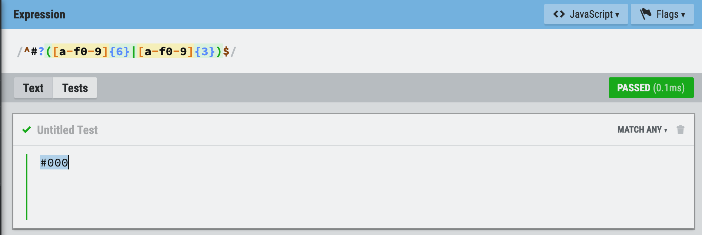

# Regex Tutorial

## Matching a Hex Value: 
<pre>/^#?([a-f0-9]{6}|[a-f0-9]{3})$/</pre>

## Summary

Here's a regex expression which matches <b>Hex Values!</b> 
In this document you can findout what each part of the expression means
<pre>/^#?([a-f0-9]{6}|[a-f0-9]{3})$/</pre>

## Table of Contents

- [Anchors](#anchors)
- [Quantifiers](#quantifiers)
- [OR Operator](#or-operator)
- [Character Classes](#character-classes)
- [Grouping and Capturing](#grouping-and-capturing)
- [Bracket Expressions](#bracket-expressions)
- [Back-references](#back-references)
- [Demo](#demo)

## Regex Components

### Anchors
<pre>/^a dog$/</pre>
`^` and `$` are called "anchors" in regex. 
The caret `^` matches at the beginning of the text, and the dollar `$` – at the end.

The pattern `^#` means string starts with `#` 
We can see if it ends with a charcter, number or underscore by using `\w$` 

### Quantifiers
<pre>[a-z0-9]{2,6}</pre>
`Quantity {n}`

#### 1. The exact count {3}
`\d{3}` is same as `\d\d\d`
it look for 3 digits

#### 2. The range {3,6}
`\d{3,6}` matches 3-6 times.
`\d{3,}` matches 3 or more digits.
<pre>/^#?([a-f0-9]{6}|[a-f0-9]{3})$/</pre>

### OR Operator
<pre>/(b|f)ox/ => will match both <b><i>box</i></b> and <b><i>fox</i></b></pre>
square brackets are similar to OR Operator, for instance gr[ae]y is either gray or grey

`gr(a|e)y` matches <u>gray</u> or <u>grey</u> 
`gra|ey` means <u>gra</u> or <u>ey</u>

### Character Classes
A character class is a special notation that matches any symbol from a certain set. 
for example: 
  - `\d`: digits[0-9] 
  - `\w`: either a letter of Latin alphabet or a digit or underscore. 
  - `\s`: includes tabs `\t`, newlines `\n` and some other rare characters, `\v`, `\f` and `\r` 

### Grouping and Capturing
<pre>/^#?([a-f0-9]{6}|[a-f0-9]{3})$/</pre>
`(...)`, this is called a capturing group.

#### Example: yoyoyo
the pattern `yo+` means `y` character followed by `o` repeated one or more times, like `yooo`

Paranthesis group characters together, so `(yo)+` means `yo`, `yoyo`, `yoyoyo` and so on

### Bracket Expressions
For example `[aeiou]` means any of the 5 characters: `a`, `e`, `i`, `o`, `u`

<pre>[a-f0-9]</pre>
`a-f` is a character in range from `a` to `z` 
`0-9` is a digit from `0` to `5`

### Demo

## Back Reference
- I use [javascript.info](https://javascript.info) as my documentation!
- [Regexer](https://regexr.com)

## Author

my github: [a-taghva](https://github.com/a-taghva)